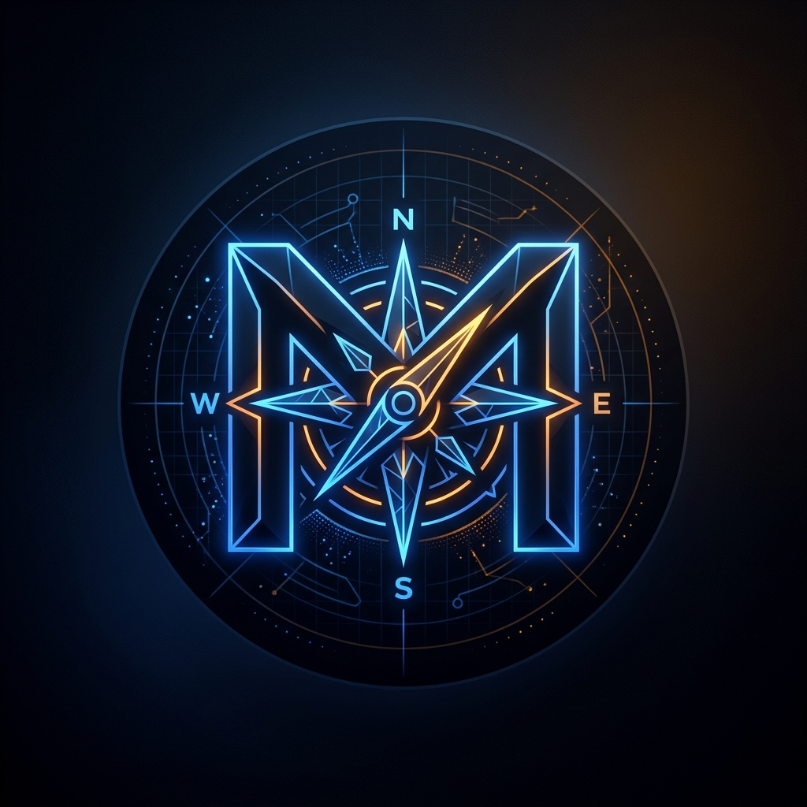

<div align="center">


<br/><br/>



# ⚡ Pankaj Kalosiya (`the.musafir`)
### 🚀 Full-Stack AI Engineer • Autonomous Systems • SaaS & Algo Trader

[](https://t.me/the_musafir)
[](https://instagram.com/the.musafirrr__)
[](mailto:musafir.developer@gmail.com)
[](https://t.me/the_musafir)

<br/>

```text
⚡ "I don't just write code — I build autonomous software products that generate real revenue."
```

</div>

---

### 👨‍💻 About Me

- 🚀 **Full-Stack AI & Automation Engineer** building commercial-grade SaaS products, autonomous multi-agent pipelines, and algorithmic trading systems.
- 🛠️ Shipped turnkey marketplace platforms, AI video generation engines, scraping infrastructure, and financial quantitative bots.
- 📍 Located in **Rajasthan, India** • Open for freelance collaborations, technical consulting, and high-impact software development worldwide.

---

### 🛠️ Tech Arsenal

<div align="center">

<a href="https://skillicons.dev">
  
</a>

<br/><br/>

| Domain | Core Technologies |
|:---|:---|
| **Frontend & Mobile Apps** | Next.js 14, React 18, TypeScript, Tailwind CSS, Capacitor (PWA & Android) |
| **Backend & Microservices** | Python, Flask, FastAPI, Node.js, Express, Firebase Firestore, SQLite |
| **Generative AI & Media Automation** | Google Gemini API, Groq LPU, Edge-TTS, MoviePy, FFmpeg, yt-dlp, n8n |
| **Algorithmic Trading & Quant** | MQL5, MQL4, MetaTrader 5 API, Latency Arbitrage, Freqtrade |
| **DevOps & Infrastructure** | Linux Ubuntu VPS, Docker Compose, Nginx Reverse Proxy, Cloudflare |

</div>

---

### 🌟 Featured Commercial & Open-Source Projects

| Project | Description | Stack | Link |
|:---|:---|:---|:---:|
| 🏋️ **FitTrack Gym PWA** | Offline-First Gym & Fitness Management PWA with BMI tracking & membership engine | `Python` `Flask` `SQLite` `PWA` | [**View Repo**](https://github.com/pixelssudio/fittrack-fitness-pwa) |
| 🎬 **AI Video Studio** | Autonomous YouTube Shorts & Reels creator with Gemini AI & automated voiceovers | `Python` `Gemini` `MoviePy` `TTS` | [**View Repo**](https://github.com/pixelssudio/youtube-shorts-ai-studio) |
| 🏙️ **Hyperlocal Portal** | Production-ready services marketplace, WhatsApp orders & Razorpay payments | `Next.js 14` `Firebase` `Capacitor` | [**View Repo**](https://github.com/pixelssudio/hyperlocal-community-portal) |
| 📈 **AntiLatency Sniper EA** | Institutional high-frequency latency arbitrage scalping bot for MT4 & MT5 | `MQL5` `MQL4` `Python` `MT5` | [**View Repo**](https://github.com/pixelssudio/antilatency-sniper-ea) |
| 💬 **Gemini WA Automation** | Smart WhatsApp bot powered by Google Gemini AI & Baileys multi-device socket | `Node.js` `Gemini AI` `Docker` | [**View Repo**](https://github.com/pixelssudio/gemini-whatsapp-automation) |
| 🛍️ **Loot & Deals Bot** | 24/7 autonomous deal scraper (Amazon, Ajio, Flipkart) with deduplication | `Python` `Telegram API` `SQLite` | [**View Repo**](https://github.com/pixelssudio/telegram-loot-deals-bot) |
| 📥 **Universal Downloader** | Multi-platform video and audio extractor with rotating proxy pool | `Python` `Flask` `yt-dlp` `Proxies` | [**View Repo**](https://github.com/pixelssudio/universal-media-downloader) |
| ⚡ **TagStorm SaaS** | AI Hashtag discovery Micro-SaaS with competition difficulty scoring | `Python` `Flask` `SQLite` `Tailwind` | [**View Repo**](https://github.com/pixelssudio/tagstorm-hashtag-saas) |
| 🤖 **Telegram Concierge** | Private AI assistant powered by Groq LPUs with zero-dependency fallback | `Python` `Groq LLaMA-3` `Asyncio` | [**View Repo**](https://github.com/pixelssudio/telegram-ai-concierge) |
| 🎯 **LeadSentinel** | Automated B2B business lead scraper & personalized cold email sequence suite | `Python` `BeautifulSoup` `SMTP` | [**View Repo**](https://github.com/pixelssudio/lead-sentinel-automation) |

---

### 📊 GitHub Activity & Real-Time Stats

<div align="center">


<br/><br/>


</div>

---

### 🤝 Let's Connect & Collaborate

Have a project idea, MVP requirement, or custom AI automation need?

[](https://t.me/the_musafir)
[](mailto:musafir.developer@gmail.com)

